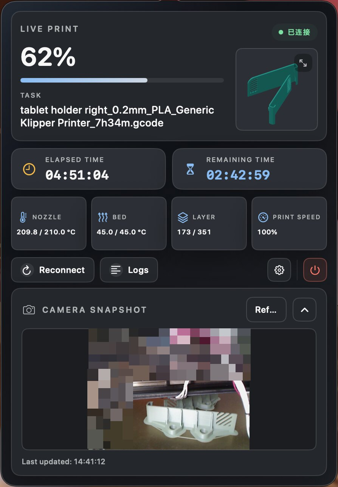
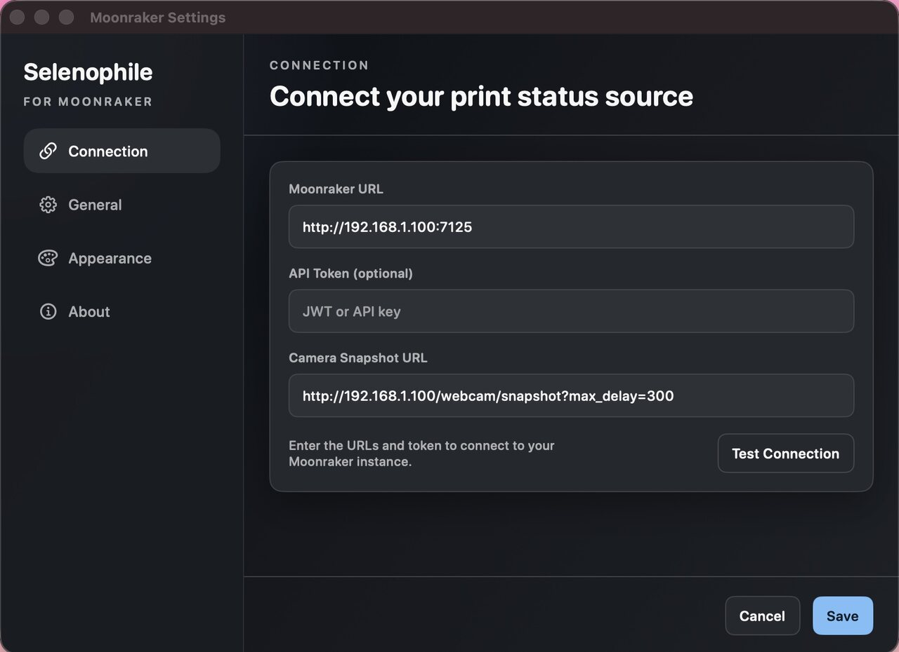
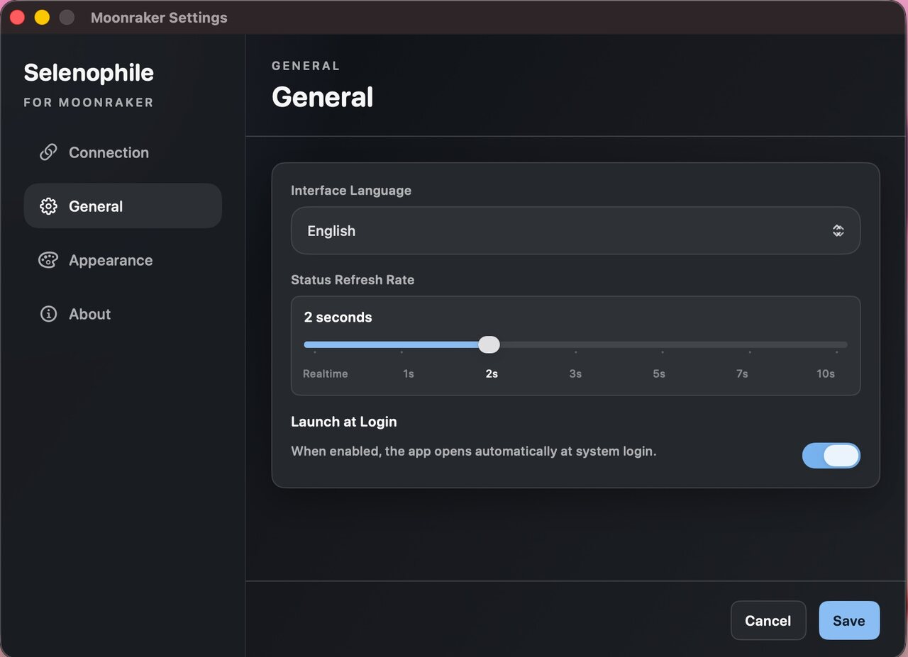
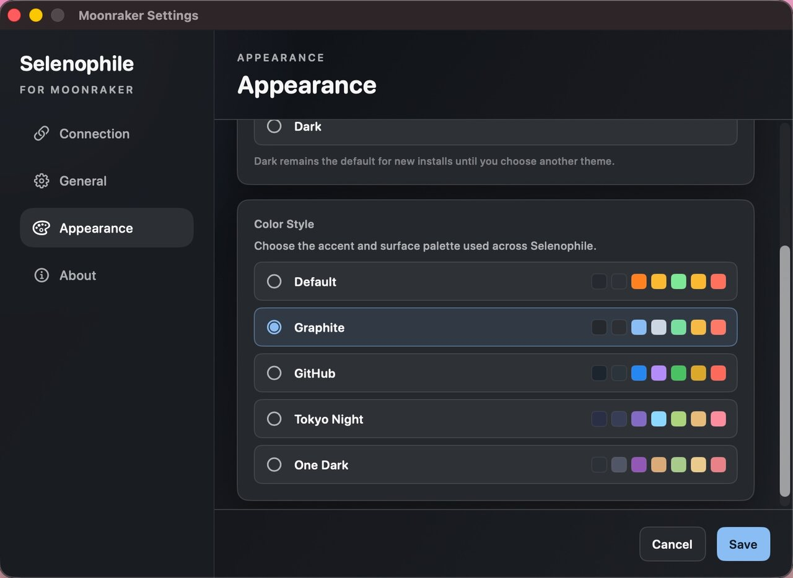

# Selenophile

[English](README.md) | [简体中文](README.zh-Hans.md) | [日本語](README.ja.md)

Klipper プリンター向けのネイティブ macOS メニューバーモニターです。

Selenophile は Moonraker / Klipper プリンターの状態を macOS のメニューバーからすばやく確認できるようにします。目的は操作ではなく監視です。現在の状態、進捗、温度、時間、レイヤー、速度、カメラスナップショット、接続トラブルの確認に使えるログを表示します。

<p>
  
</p>

## 主な機能

- コンパクトなポップオーバーを備えたネイティブ macOS メニューバーアプリ。
- Moonraker 経由で Klipper プリンターの状態をリアルタイム表示。
- 印刷進捗、ファイル名、経過時間、残り時間、レイヤー、速度、ノズル温度、ベッド温度を表示。
- 任意のカメラスナップショット表示。Moonraker ホスト上の相対パス、または完全な画像 URL を指定できます。
- 接続、更新間隔、ログイン時起動、インターフェイス言語、外観モード、カラーパレットを設定可能。
- 接続、再試行、ステータス更新、カメラリクエストの確認に使えるデバッグログ。
- Apple Silicon Mac と macOS 14 以降に対応。

## スクリーンショット

| 接続設定 | 一般設定 |
| --- | --- |
|  |  |

| 外観設定 |
| --- |
|  |

## 動作要件

- Apple Silicon Mac
- macOS 14 以降
- Moonraker が有効な Klipper プリンター

## Moonraker の設定

メニューバーのポップオーバーから **Settings** を開き、Moonraker の接続情報を入力します。

- **Moonraker URL**: 通常は `http://printer.local:7125` または `http://<printer-ip>:7125` です。
- **API Token**: 任意です。多くのローカル Moonraker 環境では、認証を有効にしていない限り token は不要です。
- **Camera Snapshot URL**: 任意です。`http://printer.local/webcam/?action=snapshot` のような完全な URL、または `/webcam/?action=snapshot` のような Moonraker ホスト上の相対パスを指定できます。

保存前に **Test Connection** で URL と token を確認できます。

## Selenophile が行わないこと

Selenophile は監視ツールであり、プリンター制御アプリではありません。G-code のアップロード、印刷開始、一時停止、キャンセル、Klipper 設定の変更は行いません。これらの操作は既存のプリンター UI で行ってください。

## 言語

アプリのインターフェイスは複数言語に対応しています。この README は英語、簡体字中国語、日本語で提供されています。

## ソースからビルド

リポジトリを clone したあと、Swift Package Manager でビルドできます。

```bash
swift build
```

テストを実行します。

```bash
swift test
```

メニューバーアプリをローカルで起動します。

```bash
./run-menubar.sh
```

ローカル app パッケージを作成します。

```bash
./Scripts/build_dmg.sh
```

Xcode プロジェクトは Tuist で管理されています。Tuist を使う場合:

```bash
tuist generate --no-open
```

リリースとアップデート配布のメモは [docs/sparkle-github-distribution.md](docs/sparkle-github-distribution.md) にあります。

## コントリビュート

Issue と pull request を歓迎します。コード変更では、メニューバーアプリを監視用途に集中させ、提出前に関連する Swift テストを実行してください。

## ライセンス

Selenophile は [MIT License](LICENSE) で公開されています。
